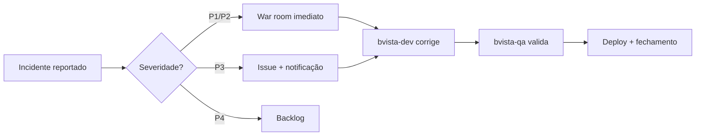

# Escalation — Farmácia Boa Vista (bvista-n2)

> Skill de escalação de incidentes para o time de suporte N2 do pdv-api.
> Define critérios, fluxo e templates para escalação entre times.

---

## Matriz de escalação

| Tipo de problema | Time responsável | SLA de resposta |
|---|---|---|
| Bug em código (lógica/Service) | bvista-dev | 2h (P1), 8h (P2) |
| Falha em testes / regressão | bvista-qa | 4h (P1/P2) |
| Problema de infraestrutura | SRE / DevOps | 1h (P1) |
| Dado corrompido em banco | DBA + bvista-dev | 1h (P1) |
| Falha de segurança (OWASP) | bvista-dev + CISO | Imediato (P1) |

---

## Critérios de escalação por severidade

### P1 — Crítico (escalar em até 15min)
- Sistema de PDV completamente indisponível
- Falha em processamento de pagamentos
- Perda ou corrupção de dados de vendas
- Brecha de segurança ativa (SQL injection, exposição de dados)

**Ação:** Notificar bvista-dev + gerência + iniciar war room

### P2 — Alto (escalar em até 1h)
- Endpoint de vendas retornando 500 em >10% das requisições
- Cancelamento de venda não funcionando
- Relatórios com dados incorretos

**Ação:** Abrir issue urgente no repo + notificar bvista-dev

### P3 — Médio (escalar em até 4h)
- Endpoint secundário com erros esporádicos
- Performance degradada (>2s de resposta)
- Validações retornando mensagens incorretas

**Ação:** Criar issue normal + notificar bvista-qa para testes

### P4 — Baixo (escalar em próximo sprint)
- Melhorias de UX na mensagem de erro
- Log verboso em ambiente de produção
- Documentação desatualizada

**Ação:** Criar issue com label `enhancement`

---

## Template de issue para GitHub

```markdown
## [INC-<N>] <Título do incidente>

**Severidade:** P1/P2/P3/P4
**Reportado por:** Time Suporte N2
**Data:** <data>

### Problema
<descrição clara do problema>

### Impacto
<quantos usuários/transações afetadas>

### Passos para reproduzir
1. <passo 1>
2. <passo 2>

### Comportamento esperado
<o que deveria acontecer>

### Comportamento atual
<o que está acontecendo>

### Evidências
```<log ou screenshot>```

### Checklist de resolução
- [ ] Causa raiz identificada
- [ ] Fix implementado
- [ ] Testes de regressão criados
- [ ] Deploy em produção
- [ ] Incidente encerrado
```

---

## Fluxo de comunicação


